# Part II. Charts and supplementary analysis

All charts and tables in this part are generated by the scripts in `research/scripts/` from SEC XBRL, 10-Q tables, FRED and price data, and are reproducible. Sections 11-17 correspond to Sections 1-9 of Part I.

## 11. The term structure: what happened this quarter

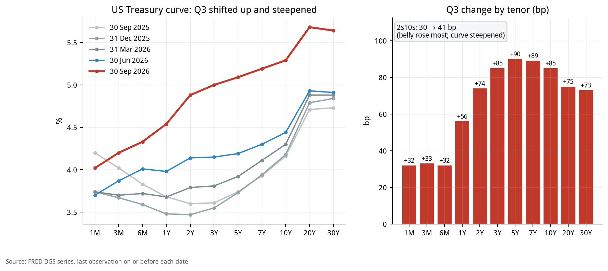

| Tenor | 2025-09-30 (%) | 2026-06-30 (%) | 2026-09-30 (%) | Q3 chg (bp) | YoY chg (bp) |
|---|---|---|---|---|---|
| 1M | 4.20 | 3.70 | 4.02 | +32 | -18 |
| 3M | 4.02 | 3.87 | 4.20 | +33 | +18 |
| 6M | 3.83 | 4.01 | 4.33 | +32 | +50 |
| 1Y | 3.68 | 3.98 | 4.54 | +56 | +86 |
| 2Y | 3.60 | 4.14 | 4.88 | +74 | +128 |
| 3Y | 3.61 | 4.15 | 5.00 | +85 | +139 |
| 5Y | 3.74 | 4.19 | 5.09 | +90 | +135 |
| 7Y | 3.93 | 4.30 | 5.19 | +89 | +126 |
| 10Y | 4.16 | 4.44 | 5.29 | +85 | +113 |
| 20Y | 4.71 | 4.93 | 5.68 | +75 | +97 |
| 30Y | 4.73 | 4.91 | 5.64 | +73 | +91 |
| 30Y mortgage | 6.30 | 6.49 | 7.03 | +54 | +73 |
| Fed funds (effective) | 4.09 | 3.63 | 3.88 | +25 | -21 |
| 2s10s (bp) | 56 | 30 | 41 | +11 | -15 |

*Source: FRED. 2s10s and changes are in bp; the rest in %.*

### How to read it

- **Shape**: the Q3 rise was not parallel. The short end (1M-6M) rose only about 32-33bp, 1Y rose 56bp, 2Y 74bp, 3Y-7Y 85-90bp (the 5Y was the largest), 10Y 85bp, and 20Y-30Y about 73-75bp. The belly (around 5Y) moved the most, so the slope between 3M and 5Y steepened sharply.

- **2s10s**: 41bp at quarter-end vs. 30bp at the start, only 11bp wider, but the path was uneven: it narrowed to about 22bp on 9/22 (Figure 3, right).

- **Year-on-year (comparability)**: versus a year earlier (2025-09-30), the 2Y is 128bp higher and the 10Y 113bp higher, while the effective fed funds rate is actually 21bp lower (4.09% to 3.88%). The rise in the intermediate and long end was mainly not driven by the policy rate. 2s10s is narrower YoY (56bp to 41bp).

- **Average vs. exit**: the effective fed funds rate averaged only 4bp above Q2 in Q3, since the hike came on 9/16; it ended 25bp above 6/30. Most of the rise in liability costs lands in Q4.

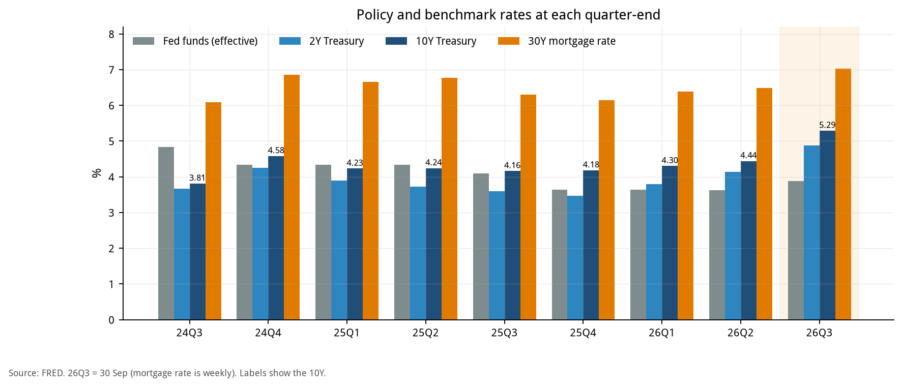

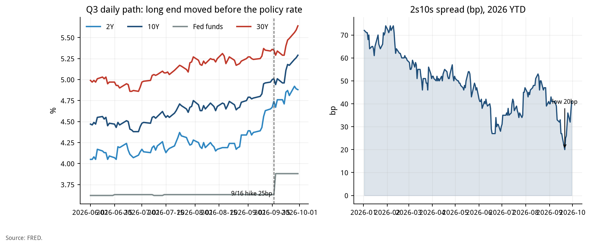

*Figure 2 puts nine quarters side by side: from 2025Q3 to 2026Q2 the effective policy rate fell from 4.09% to 3.63% while the 10Y rose from 4.16% to 4.44%, and in 2026Q3 the long end rose sharply again. That is the background for Q3's 'long end first, policy rate later' pattern.*

## 12. How the term-structure move feeds deposit cost and loan income

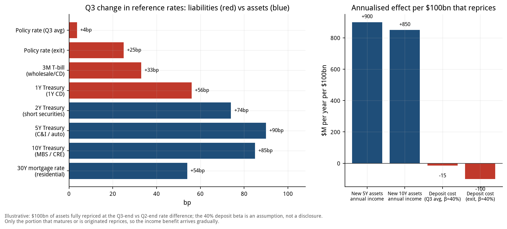

| Bank product / asset | Reference rate | Q3 change (bp) | Side |
|---|---|---|---|
| Core deposits (avg) | Fed funds (Q3 average) | +4 | Liability |
| Core deposits (exit) | Fed funds (exit) | +25 | Liability |
| Wholesale / CD | 3M | +33 | Liability |
| 1Y CD | 1Y | +56 | Liability |
| Short securities | 2Y | +74 | Asset |
| C&I / auto loans | 5Y | +90 | Asset |
| MBS / CRE | 10Y | +85 | Asset |
| Residential mortgages | 30Y mortgage rate | +54 | Asset |

### Illustrative calculation (per $100bn that reprices)

| Item | Annualised ($M) |
|---|---|
| Income gain on new / reinvested 5Y assets | +900 |
| Income gain on new / reinvested 10Y assets | +850 |
| Deposit cost increase (Q3 average, beta 40%) | -15 |
| Deposit cost increase (exit rate, beta 40%) | -100 |
| Deposit cost increase (exit rate, beta 60%) | -150 |

- **Meaning**: for every $100bn of assets repricing at the new rates, annual income rises about $900M (5Y basis), while the Q3-average deposit cost rises only about $15M. This is the 'assets reprice before liabilities' NII tailwind described in Section 0.

- **The tailwind narrows**: at the exit rate and beta 40%, deposit cost rises $100M; at beta 60% it is $150M. Deposit costs reflect the 9/16 hike fully only from Q4, so the tailwind fades quarter by quarter.

- **Only part of the book reprices**: actual NII is affected only by assets that mature or are newly originated in the period. The chart is an upper-bound illustration, not an NII forecast. For NII forecasts see Sections 3.1 and 4.

- **Assumptions**: 100% of the $100bn reprices at the Q3-end minus Q2-end rate difference; deposit beta of 40% is an assumption, not a disclosure.

## 13. Segment revenue of the six large banks: two-year trend and Q3 forecast

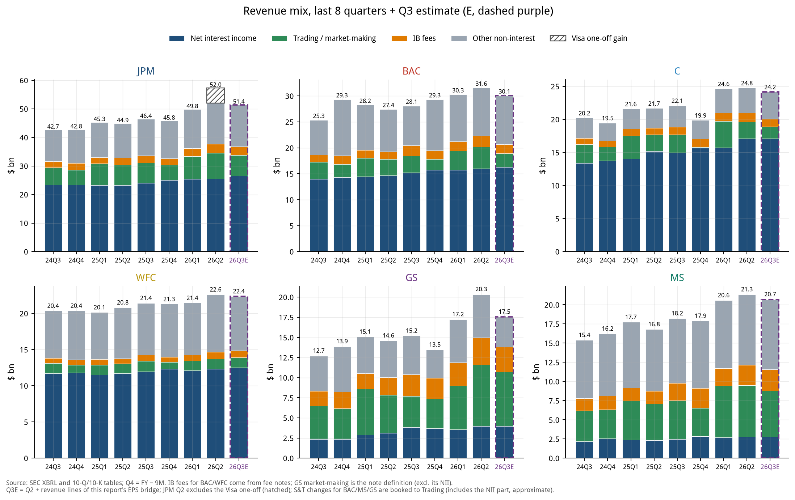

| Bank | Q3'25 | Q2'26 (JPM ex-Visa) | Q3'26E | QoQ | YoY |
|---|---|---|---|---|---|
| JPM | 46.4 | 52.0 | 51.4 | -1.1% | +10.8% |
| BAC | 28.1 | 31.6 | 30.1 | -4.8% | +7.0% |
| C | 22.1 | 24.8 | 24.2 | -2.4% | +9.4% |
| WFC | 21.4 | 22.6 | 22.4 | -1.1% | +4.4% |
| GS | 15.2 | 20.3 | 17.5 | -13.8% | +15.5% |
| MS | 18.2 | 21.3 | 20.7 | -3.0% | +13.6% |

*Total revenue, $bn, GAAP basis (NII + non-interest income).*

### Q3'26E revenue by segment ($bn)

| Bank | NII | IB fees | Trading | Other | Total |
|---|---|---|---|---|---|
| JPM | 26.51 | 3.05 | 7.31 | 14.56 | 51.43 |
| BAC | 16.30 | 1.74 | 2.63 | 9.40 | 30.06 |
| C | 17.13 | 1.21 | 1.78 | 4.05 | 24.17 |
| WFC | 12.52 | 0.94 | 1.39 | 7.52 | 22.37 |
| GS | 3.95 | 3.10 | 6.74 | 3.75 | 17.54 |
| MS | 2.78 | 2.75 | 6.02 | 9.14 | 20.70 |

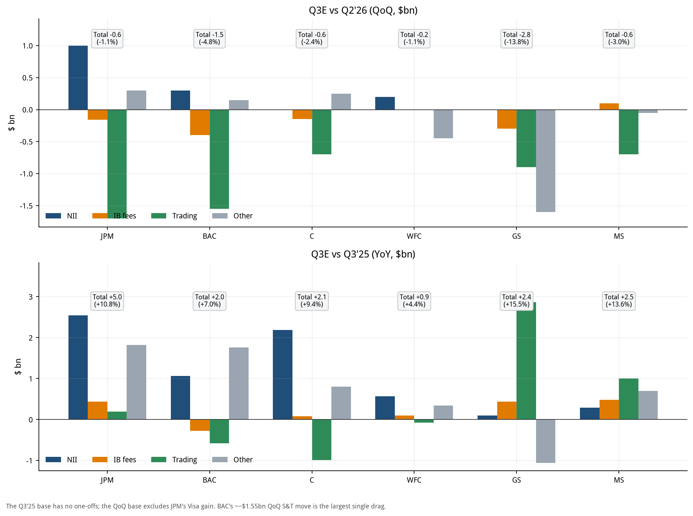

### Q3'26E change vs. Q2'26 ($bn)

| Bank | NII | IB fees | Trading | Other | Total |
|---|---|---|---|---|---|
| JPM | +1.00 | -0.16 | -1.70 | +0.30 | -0.56 |
| BAC | +0.30 | -0.40 | -1.55 | +0.15 | -1.50 |
| C | 0.00 | -0.15 | -0.70 | +0.25 | -0.60 |
| WFC | +0.20 | 0.00 | 0.00 | -0.45 | -0.25 |
| GS | 0.00 | -0.30 | -0.90 | -1.60 | -2.80 |
| MS | 0.00 | +0.10 | -0.70 | -0.05 | -0.65 |

### Q3'26E change vs. Q3'25 ($bn)

| Bank | NII | IB fees | Trading | Other | Total |
|---|---|---|---|---|---|
| JPM | +2.55 | +0.44 | +0.20 | +1.82 | +5.00 |
| BAC | +1.06 | -0.28 | -0.58 | +1.76 | +1.97 |
| C | +2.19 | +0.08 | -0.99 | +0.80 | +2.08 |
| WFC | +0.57 | +0.10 | -0.07 | +0.34 | +0.94 |
| GS | +0.10 | +0.44 | +2.87 | -1.06 | +2.35 |
| MS | +0.29 | +0.49 | +1.00 | +0.70 | +2.47 |

### How to read it

- **QoQ: capital markets fall, NII still rises.** The trading line falls or is flat at all six, and the IB line falls at most of them; NII rises at JPM, BAC and WFC, while for C, GS and MS our bridge has no NII item so NII is held flat.

- **BAC's trading line** falls -1.55B QoQ (Q2 4.18B to Q3E 2.63B), among the largest single contractions of the six, and the core reason BAC's EPS falls short of consensus in Section 4.1.

- **GS has the largest decline** (total revenue -13.8% QoQ), mainly from 'other non-interest' (the investing lines, -1.60B) and trading (-0.90B). It is still +15.5% YoY because the Q3'25 base was low.

- **Comparability**: JPM's roughly $5.4B Visa one-off in Q2'26 is hatched in Figure 5 and removed in the QoQ tables and Figure 6; otherwise JPM's QoQ would be overstated at about -10%.

- **Limits**: for C the Q4 NII, IB and trading lines come from XBRL fill-ins rather than the 10-K table; Q3E comes from our bridge (Section 4), and for WFC the IB and trading lines have no guidance and are held flat.

## 14. EPS, P/E and market indicators

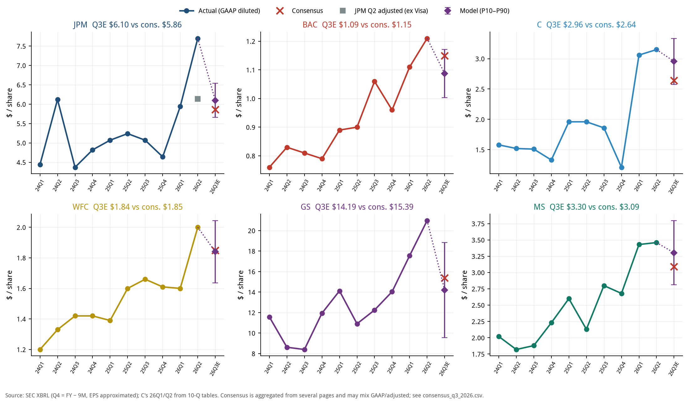

| Bank | Q3'25 EPS | Q2'26 EPS (JPM ex-Visa) | Q3E consensus | Q3E model | P10-P90 | vs. cons. | YoY |
|---|---|---|---|---|---|---|---|
| JPM | 5.07 | 6.14 | 5.86 | 6.10 | 5.66-6.54 | +4.0% | +20.2% |
| BAC | 1.06 | 1.21 | 1.15 | 1.09 | 1.00-1.17 | -5.5% | +2.5% |
| C | 1.86 | 3.15 | 2.64 | 2.96 | 2.58-3.33 | +11.9% | +58.9% |
| WFC | 1.66 | 2.00 | 1.85 | 1.84 | 1.64-2.04 | -0.5% | +10.8% |
| GS | 12.25 | 20.98 | 15.39 | 14.19 | 9.57-18.84 | -7.8% | +15.9% |
| MS | 2.80 | 3.46 | 3.09 | 3.30 | 2.81-3.80 | +6.9% | +18.0% |

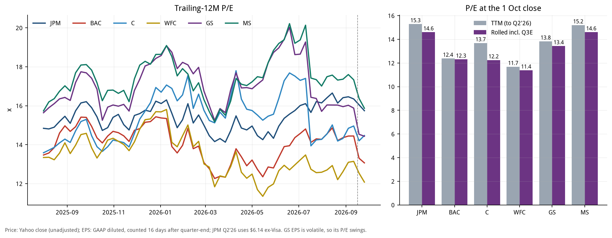

| Bank | 1 Oct close ($) | TTM EPS ($) | P/E a year ago | P/E now | EPS rolled incl. Q3E ($) | P/E (incl. Q3E) |
|---|---|---|---|---|---|---|
| JPM | 333.18 | 21.79 | 15.9x | 15.3x | 22.82 | 14.6x |
| BAC | 53.73 | 4.34 | 14.9x | 12.4x | 4.37 | 12.3x |
| C | 127.00 | 9.28 | 14.6x | 13.7x | 10.38 | 12.2x |
| WFC | 80.25 | 6.87 | 13.9x | 11.7x | 7.05 | 11.4x |
| GS | 896.67 | 64.82 | 17.3x | 13.8x | 66.76 | 13.4x |
| MS | 188.01 | 12.37 | 17.7x | 15.2x | 12.87 | 14.6x |

*P/E = unadjusted close ÷ TTM EPS (GAAP diluted; JPM Q2'26 uses $6.14 ex-Visa; a quarter counts 16 days after quarter-end). GS's quarterly EPS is volatile, so its P/E swings.*

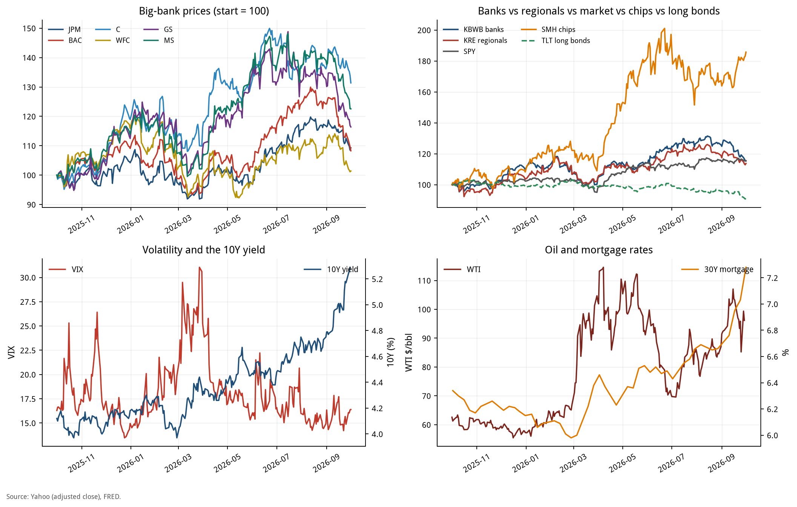

### How to read it

- **Valuation**: on TTM, JPM has the highest P/E (15.3x) and WFC the lowest (11.7x); once Q3E is rolled in, every P/E changes by an amount that depends on Q3E EPS vs. Q3'25.

- **EPS vs. consensus**: the model is above consensus for C, MS and JPM, below for BAC and GS, and roughly in line for WFC (see the table and the Figure 7 titles). Q2'26 was a record quarter, so Q3E is down QoQ nearly everywhere, but mostly still up YoY.

- **Market**: Figure 9 shows the March VIX spike and price drawdown, followed by a recovery in the large banks; from September the 10Y and mortgage rates rose together, TLT fell, and bank and regional-bank ETFs pulled back (Section 6.1). SMH has far outpaced banks, consistent with the 'most like 1999' analogue in Section 8.

## 15. AFS / HTM book values and what they mean for the large banks

This section covers only the six large banks (JPM, BAC, C, WFC, GS, MS); regional banks are in the scorecard in Section 7.

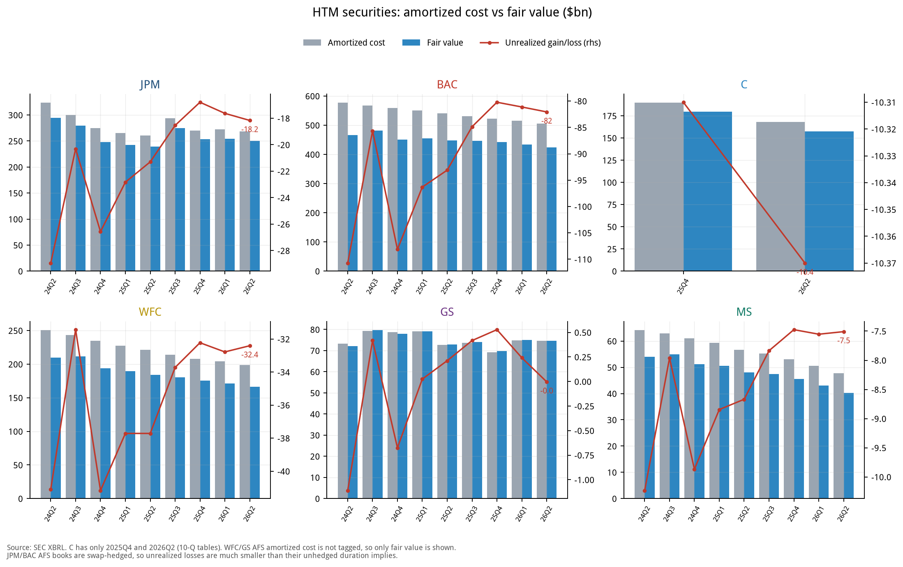

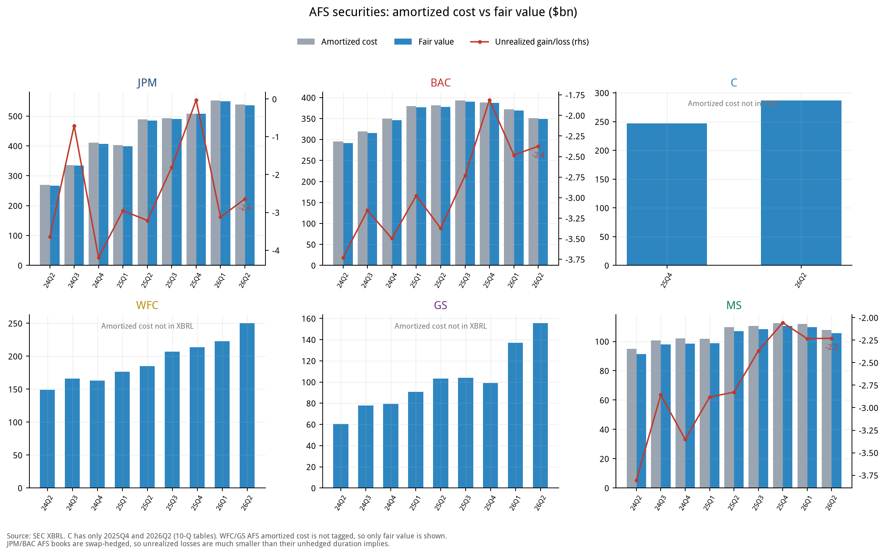

| Bank | AFS fair value 6/30/26 | HTM amortised cost 6/30/26 | HTM fair value 6/30/26 | HTM unrealised G/L 6/30/25 | HTM unrealised G/L 12/31/25 | HTM unrealised G/L 6/30/26 |
|---|---|---|---|---|---|---|
| JPM | 536.0 | 268.5 | 250.3 | -21.3 | -16.8 | -18.2 |
| BAC | 348.5 | 505.8 | 423.7 | -93.1 | -80.2 | -82.1 |
| C | 286.8 | 167.9 | 157.5 | n/a | -10.3 | -10.4 |
| WFC | 250.3 | 198.6 | 166.2 | -37.7 | -32.2 | -32.4 |
| GS | 155.6 | 74.7 | 74.7 | 0.2 | 0.5 | -0.0 |
| MS | 105.5 | 47.7 | 40.2 | -8.7 | -7.5 | -7.5 |

*$bn, SEC XBRL; C's 12/31/25 and 6/30/26 come from 10-Q tables and 6/30/25 is unavailable. GS and MS have small HTM books.*

### How much the Q3 rate rise lowers book value (pro forma)

| Bank | TCE ($bn) | AFS→AOCI ($bn) | % of TCE | HTM mark, after tax ($bn) | % of TCE | Q3E quarterly earnings ($bn) | Total ÷ Q3E earnings |
|---|---|---|---|---|---|---|---|
| JPM | 300.9 | -8.20 | -2.7% | -3.27 | -1.1% | 16.3 | 0.70x |
| BAC | 206.0 | -2.42 | -1.2% | -10.43 | -5.1% | 7.8 | 1.64x |
| C | 168.4 | -2.67 | -1.6% | -3.10 | -1.8% | 5.1 | 1.14x |
| WFC | 139.9 | -4.99 | -3.6% | -3.59 | -2.6% | 5.6 | 1.54x |
| GS | 100.4 | -1.86 | -1.9% | -1.38 | -1.4% | 4.3 | 0.75x |
| MS | 84.1 | -1.74 | -2.1% | -0.88 | -1.0% | 5.2 | 0.51x |

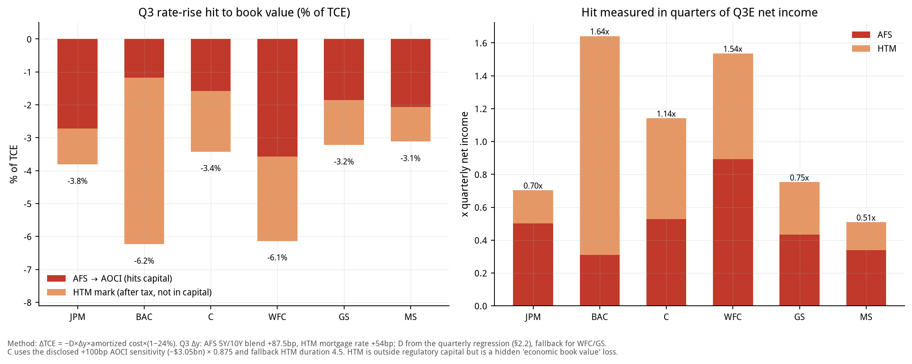

### How to read it

- **BAC is the special case**: its AFS has about a 1-year duration and is swap-hedged, so the AOCI hit is small (-1.2% of TCE); but the HTM book is $506B with a $82.1B unrealised loss (about 40% of TCE), and Q3 adds about $13.7B (pre-tax). It does not enter regulatory capital but is a hidden loss in economic TBV.

- **WFC**: both AFS and HTM carry risk and the Q3 total hit as a share of TCE is among the highest; its AFS amortised cost is missing in XBRL and a fallback duration is used, so precision is lower.

- **JPM**: an HTM unrealised loss of roughly $18B and an AFS loss of only $2.6B (because of hedging); relative to TCE and earnings the impact is mid-range.

- **GS and MS**: GS's HTM amortised cost is about equal to fair value (unrealised G/L near zero) and MS has a $7.5B loss; both have small AOCI hits. GS's AFS is mostly short-duration T-bills.

- **C**: AOCI uses the +100bp sensitivity disclosed in its 10-Q (-$3.0B after tax) scaled by 0.875 to approximate Q3's 87.5bp; the HTM duration of 4.5 years is an assumption.

- **Method**: AFS hit = -D x Δy x amortised cost x (1 - 24%) with Δy = +87.5bp; HTM mark = -D x Δy x amortised cost (Δy = mortgage rate +54bp), converted to after-tax at 24% in the table. See Section 2.2 for the formula.

## 16. Rate stress test: if the Fed keeps hiking

**Question**: on top of the Q3 rise that has already happened, how large is the first-year economic effect on the six large banks if the curve moves up again?

| Scenario | Short-end shock | Long-end shock | Meaning |
|---|---|---|---|
| +50bp parallel | +50bp | +50bp | Two more 25bp hikes with the long end moving in step |
| +100bp parallel | +100bp | +100bp | Baseline stress |
| +200bp parallel | +200bp | +200bp | Severe scenario |
| Bear steepener: long end +100bp | 0 | +100bp | Term premium rises, policy rate unchanged |
| Bear flattener: short end +100bp | +100bp | 0 | Pure policy-rate shock; AFS/HTM valuations unchanged |

### Method

- **NII**: the 12-month NII sensitivities each bank discloses in its 10-Q (+100bp, +200bp, long end +100bp, short end +100bp), 24% tax; +50bp = 0.5 x (+100bp).

- **AFS→AOCI**: duration model x long-end shock (for C, the initial AOCI impact disclosed in its 10-Q), after tax; occurs immediately.

- **HTM mark**: duration x long-end shock x amortised cost, converted to after-tax at 24%; it does not enter regulatory capital or the income statement, only economic value.

- **Net economic effect** = 12M NII (after tax) + AOCI + HTM mark (after tax). **Net capital effect** = NII + AOCI (no HTM). Ratios use 6/30 TCE and annualised earnings of '4 x Q3E EPS x shares'.

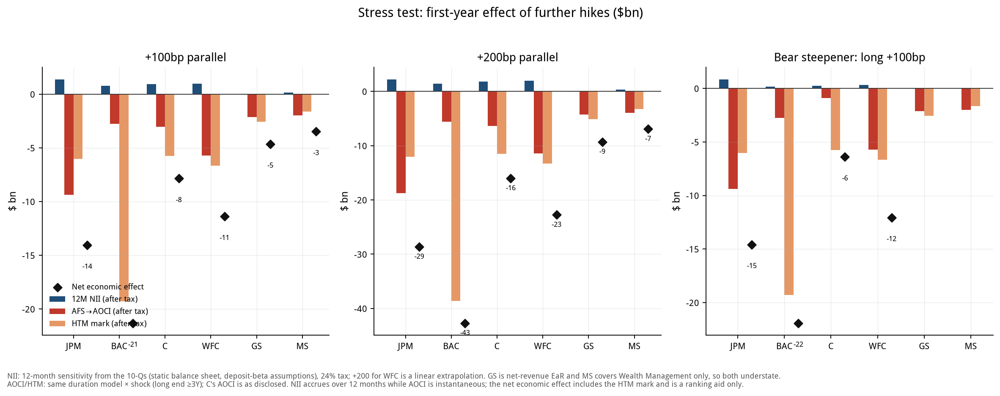

### Net economic effect ($bn)

| Bank | +50bp parallel | +100bp parallel | +200bp parallel | Steepener long +100 | Flattener short +100 |
|---|---|---|---|---|---|
| JPM | -7.0 | -14.0 | -28.6 | -14.6 | +0.5 |
| BAC | -10.7 | -21.3 | -42.7 | -21.9 | +0.6 |
| C | -3.9 | -7.9 | -16.0 | -6.4 | -1.5 |
| WFC | -5.7 | -11.4 | -22.7 | -12.1 | +0.7 |
| GS | -2.3 | -4.6 | -9.3 | n/a | n/a |
| MS | -1.7 | -3.5 | -6.9 | n/a | n/a |

### Net economic effect as % of TCE

| Bank | +50bp parallel | +100bp parallel | +200bp parallel | Steepener long +100 | Flattener short +100 |
|---|---|---|---|---|---|
| JPM | -2.3 | -4.7 | -9.5 | -4.8 | +0.2 |
| BAC | -5.2 | -10.3 | -20.7 | -10.6 | +0.3 |
| C | -2.3 | -4.7 | -9.5 | -3.8 | -0.9 |
| WFC | -4.1 | -8.1 | -16.3 | -8.6 | +0.5 |
| GS | -2.3 | -4.6 | -9.2 | n/a | n/a |
| MS | -2.1 | -4.1 | -8.2 | n/a | n/a |

### Net economic effect as % of annualised Q3E earnings

| Bank | +50bp parallel | +100bp parallel | +200bp parallel | Steepener long +100 | Flattener short +100 |
|---|---|---|---|---|---|
| JPM | -11 | -22 | -44 | -22 | +1 |
| BAC | -34 | -68 | -136 | -70 | +2 |
| C | -19 | -39 | -79 | -32 | -8 |
| WFC | -25 | -51 | -102 | -54 | +3 |
| GS | -13 | -27 | -54 | n/a | n/a |
| MS | -8 | -17 | -34 | n/a | n/a |

### Composition of the +100bp parallel scenario ($bn)

| Bank | 12M NII (after tax) | AFS→AOCI | HTM mark (after tax) | Net capital effect | Net economic effect |
|---|---|---|---|---|---|
| JPM | +1.37 | -9.38 | -6.04 | -8.01 | -14.05 |
| BAC | +0.76 | -2.77 | -19.30 | -2.01 | -21.31 |
| C | +0.94 | -3.05 | -5.74 | -2.11 | -7.85 |
| WFC | +0.99 | -5.71 | -6.66 | -4.72 | -11.37 |
| GS | +0.04 | -2.13 | -2.55 | -2.09 | -4.64 |
| MS | +0.15 | -1.99 | -1.63 | -1.84 | -3.47 |

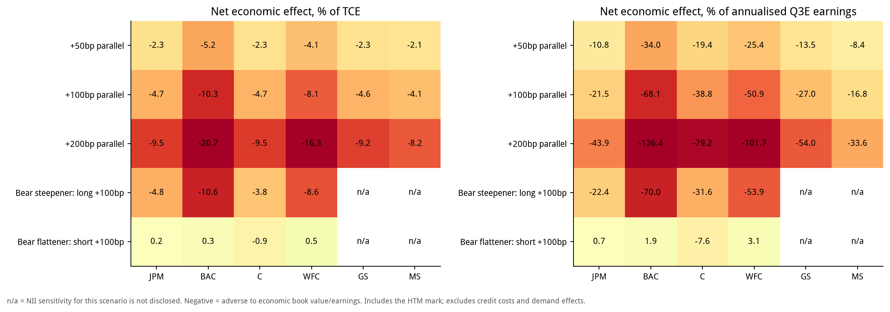

### How to read it

- **BAC is the most fragile, almost entirely through HTM**: +100bp gives a net economic effect of -$21.3B (-10.3% of TCE, -68% of annualised earnings), of which HTM is -$19.3B; the part that enters capital (NII + AOCI) is only -$2.0B. At +200bp the net economic effect exceeds a full year of earnings.

- **WFC is next**: -$11.4B (-8.1% of TCE); unlike BAC, WFC's AFS is also sensitive (AOCI -$5.7B), so the part that enters capital is also sizeable (-$4.7B).

- **JPM has the largest NII tailwind** (+$1.4B after tax at +100bp, the highest of the six), which offsets part of the valuation loss; net economic effect -$14.0B, 22% of annualised earnings.

- **Steepener vs. flattener**: a long-end shock (steepener) is net negative for all four commercial banks because the AOCI and HTM valuation losses exceed the added NII; a short-end shock (flattener) is slightly net positive for JPM, BAC and WFC (NII rises, valuations unchanged) and slightly negative for C (its disclosed short-end AOCI hit is larger). **The risk is in the long end, not in the policy rate.**

- **GS and MS** NII sensitivities are not comparable (GS reports earnings-at-risk on net revenue, MS covers Wealth Management only), so their NII is understated and net effects overstated; steepener/flattener sensitivities are not disclosed (n/a).

### Limits

- Linear duration with no convexity; AFS/HTM durations are regression or fallback values (AFS 3.0 years, HTM 4.5 years), not disclosures.

- Based on the 6/30 balance sheet and 6/30 10-Q sensitivities, not updated to quarter-end; the Q3 rise that has already happened is in Section 15 and is additive to, not included in, the stress test.

- No credit costs, loan-demand changes, deposit outflows or changes in reinvestment strategy, which are usually the larger uncertainties in a hiking cycle.

- The net economic effect adds NII earned gradually over a year to instantaneous valuation losses and is a ranking aid, not a capital-ratio forecast. HTM losses are realised only on sale or reclassification.

- WFC's +200bp NII is not disclosed and is extrapolated linearly.

## 17. IPOs: what was done in Q3, what is still coming in Q4, and the fees

**The big picture**: Q3 US IPOs were about 31 deals raising about $34.9B, of which SK hynix alone was about $26.5B; excluding it, only about $8.4B. We reviewed 18 deals one by one (about $32.6B in total, about $6.1B excluding SK hynix, roughly 73% of the ex-mega total). Fees are **disclosed** or **spread x size estimates**; per-bank splits are role-weighted estimates.

### 17.1 Q3 deals and underwriting fees

| Deal | Date | Sector | Proceeds ($M) | Fee ($M) | Spread | Basis | Lead / joint banks (selected) |
|---|---|---|---|---|---|---|---|
| SK hynix | 2026-07-09 | Semis / ADR | 26,507 | 257.5 | 0.97% | disclosed | BofA / Citi / GS / JPM (global coordinators) |
| Jersey Mike's | 2026-07-29 | Consumer | 1,000 | 50.0 | 5.00% | disclosed | MS / Jefferies / JPM (global coordinators); Barclays, Guggenheim |
| Csquare | 2026-07-16 | Telecom svcs | 1,050 | 40.0 | 3.81% | disclosed | MS, TD (reps); Wells, BofA, BMO, Scotia, JPM |
| Accelevation | 2026-09-30 | Industrial | 540 | 27.0 | 5.00% | est. | MS, JPM, GS, Barclays, BofA |
| ADARx | 2026-09-24 | Biotech | 446 | 31.2 | 7.00% | est. | JPM, MS, TD Cowen, UBS |
| Braveheart Bio | 2026-08-05 | Biotech | 383 | 26.8 | 7.00% | est. | GS, Jefferies, TD Cowen, Stifel, Cantor |
| Electra | 2026-09-17 | Biotech | 350 | 24.5 | 7.00% | est. | Jefferies, TD Cowen, Evercore, Cantor |
| Latigo | 2026-08-06 | Biotech | 346 | 24.2 | 7.00% | est. | GS, Jefferies, Leerink, Guggenheim |
| Lyntris | 2026-08-18 | Tech | 298 | 20.9 | 7.00% | est. | Evercore, Citi, Guggenheim; BofA |
| Attovia | 2026-08-04 | Biotech | 289 | 20.2 | 7.00% | disclosed | MS, Leerink, Citi, RBC |
| Orion180 | 2026-09-17 | Biotech | 240 | 16.8 | 7.00% | est. | RBC, UBS, Raymond James; GS |
| Reformation | 2026-07-29 | Consumer | 211 | 14.8 | 7.00% | est. | JPM, MS; Citi, RBC |
| Apnimed | 2026-07-30 | Biotech | 192 | 13.4 | 7.00% | est. | BofA, Evercore, Cantor, LifeSci |
| Robinhood Ventures Fund II | 2026-09 | Closed-end fund | 200 | 9.0 | 4.50% | est. | GS, Citi, JPM, UBS, Wells |
| Standard Nuclear | 2026-07-15 | Energy | 150 | 10.5 | 7.00% | est. | BofA, GS |
| BlossomHill | 2026-08-06 | Biotech | 150 | 10.5 | 7.00% | est. | JPM, Leerink, Guggenheim |
| American Savings Bank | 2026-09-15 | Bank (secondary) | 129 | 7.7 | 6.00% | est. | Piper Sandler |
| River City Bank | 2026-08-05 | Bank (secondary) | 122 | 5.9 | 4.87% | disclosed | KBW |
| **Total** |  |  | 32,602 | 611.0 | 1.87% |  |  |

*Dates are pricing dates. Accelevation priced on 9/30 with settlement around quarter-end, so the quarter in which fees are recognised depends on each bank's accounting policy. SK hynix is US-listed and its $257.5M fee (about 0.97%) is disclosed; Jersey Mike's $50.0M, Csquare $40.0M (shares introduced by Brookfield carry no fee), Attovia $20.23M and River City Bank $5.913M are also disclosed. The rest follow US convention: about 7% below $500M, about 5% for $500M-1B, and a 4.5% load for the closed-end fund.*

### 17.2 Estimated Q3 IPO underwriting fees of the six large banks

| Deal ($M) | JPM | BAC | C | WFC | GS | MS | Other underwriters |
|---|---|---|---|---|---|---|---|
| SK hynix | 55.0 | 55.0 | 70.0 | - | 55.0 | - | 22.5 |
| Jersey Mike's | 6.7 | 3.3 | - | - | 3.3 | 6.7 | 30.0 |
| Csquare | 3.3 | 3.3 | - | 3.3 | - | 6.7 | 23.3 |
| Accelevation | 4.9 | 2.5 | - | - | 4.9 | 4.9 | 9.8 |
| ADARx | 7.8 | - | - | - | - | 7.8 | 15.6 |
| Braveheart Bio | - | - | - | - | 7.7 | - | 19.1 |
| Electra | - | - | - | - | - | - | 24.5 |
| Latigo | - | - | - | - | 8.1 | - | 16.1 |
| Lyntris | - | 3.0 | 6.0 | - | - | - | 11.9 |
| Attovia | - | - | 3.4 | - | - | 6.7 | 10.1 |
| Orion180 | - | - | - | - | 2.4 | - | 14.4 |
| Reformation | 4.9 | - | 2.5 | - | - | 4.9 | 2.5 |
| Apnimed | - | 4.5 | - | - | - | - | 9.0 |
| Robinhood Ventures Fund II | 1.5 | - | 1.5 | 1.5 | 1.5 | - | 3.0 |
| Standard Nuclear | - | 4.2 | - | - | 4.2 | - | 2.1 |
| BlossomHill | 3.5 | - | - | - | - | - | 7.0 |
| American Savings Bank | - | - | - | - | - | - | 7.7 |
| River City Bank | - | - | - | - | - | - | 5.9 |
| **Total** | 87.6 | 75.8 | 83.3 | 4.8 | 87.1 | 37.7 | 234.6 |

| Bank | Deals | Est. IPO fees ($M) | Q3E IB fees ($M) | Share |
|---|---|---|---|---|
| JPM | 8 | 87.6 | 3,048 | 2.9% |
| BAC | 7 | 75.8 | 1,738 | 4.4% |
| C | 5 | 83.3 | 1,208 | 6.9% |
| WFC | 2 | 4.8 | 939 | 0.5% |
| GS | 8 | 87.1 | 3,100 | 2.8% |
| MS | 6 | 37.7 | 2,751 | 1.4% |

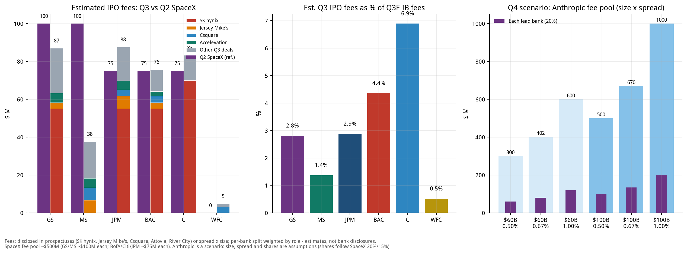

### How to read it

- **IPO fees are a small slice of IB fees**: the highest of the six is C at only about 6.9%; the rest are mostly 1%-5%. The bulk of IB fees comes from M&A advisory, debt and leveraged-finance underwriting. This supports Section 0's point that 'a hot IPO market does not hold up for Q3 fees'.

- **One deal decides the ranking**: SK hynix's $257.5M fee is 42% of all fees in the reviewed deals; Citi is estimated at about $70M (reported as above $70M), and BofA, GS, JPM at about $55M each (estimates); without it each bank's IPO fees are only in the low tens of millions.

- **Spread falls with size**: SK hynix about 0.97%, SpaceX about 0.67% (about $500M on a $75B base deal), $1B-class deals about 4%-5%, and biotechs under $300M about 7%. A large raise does not mean large fees.

- **Q2 comparison**: SpaceX alone had a fee pool of about $500M (GS and MS about $100M each, BofA, Citi and JPM about $75M each), comparable to the combined fees of all 18 Q3 IPOs we reviewed (about $611M). It was the key to the record Q2 IB fees.

### 17.3 Known Q4 IPO pipeline

| Deal | Timing | Size ($M) | Assumed spread | Fee est. ($M) | Leads | Status |
|---|---|---|---|---|---|---|
| Anthropic | Nov 2026 (after midterms) | 100,000 | 0.67% | 670 | MS, GS (leads); JPM, Citi | roadshow mid-Oct; no public S-1 yet |
| Oura | Postponed on 9/29 | 2,150 | 5.00% | 108 | n/d | planned 50M sh at $40-44; postponed |
| Entrata | Q4 | 500 | 6.00% | 30 | GS, JPM, Barclays | NYSE: ENT; ~$500M target |
| SB Energy | Q4 (reportedly delayed) | n/d | - | n/d | JPM, GS, MS, Citi + others | S-1/A #2 on 9/21; NVIDIA $3B private placement |
| Encore | Q4 | n/d | - | n/d | BofA, GS, MS | size n/d |
| Aggreko | Q4 | n/d | - | n/d | n/d | F-1 filed, NYSE: AGKO |
| Nscale | Q4 | n/d | - | n/d | n/d | NYSE filing |
| Inspire Brands | year-end / early 2027 | n/d | - | n/d | n/d | timing may slip |
| City Therapeutics | Q4 | n/d | - | n/d | GS, Jefferies | biotech; size n/d |
| OpenAI | 2027 | n/d | - | n/d | n/d | pushed to 2027 |

*n/d = not disclosed. Apart from Anthropic, sizes come from media reports or filings and may change; spreads are assumptions. Oura was postponed on 9/29. Other pipeline names (Switch, Holtec Nuclear, Tailored Brands, CoVolt Power, Wella, Iambic, Retension, TRex Bio, etc.) mostly have undisclosed sizes and are not estimated. Renaissance estimates 40-70 sizeable US IPOs by year-end could raise more than $125B, depending on whether the mega deals happen.*

### 17.4 The Anthropic scenario: the biggest Q4 fee variable

Media reports say Anthropic is targeting a November listing after the midterms, raising up to about $100B at a valuation of about $2T, with a roadshow expected in mid-October, MS and GS leading and JPM and Citi involved; there is no public S-1 as of this writing and none of this is confirmed. OpenAI has been pushed to 2027. The table below is an assumption-driven scenario, not a forecast.

| Size | Spread | Fee pool ($M) | Each lead bank, 20% ($M) | Each other major, 15% ($M) |
|---|---|---|---|---|
| $60B | 0.50% | 300 | 60 | 45 |
| $60B | 0.67% | 402 | 80 | 60 |
| $60B | 1.00% | 600 | 120 | 90 |
| $100B | 0.50% | 500 | 100 | 75 |
| $100B | 0.67% | 670 | 134 | 101 |
| $100B | 1.00% | 1,000 | 200 | 150 |

| Bank (base case: $100B, 0.67%) | Share assumption | Est. fee ($M) | Q3E IB fees ($M) | As % of a quarter's IB fees |
|---|---|---|---|---|
| MS | 20% | 134 | 2,751 | 4.9% |
| GS | 20% | 134 | 3,100 | 4.3% |
| JPM | 15% | 101 | 3,048 | 3.3% |
| C | 15% | 101 | 1,208 | 8.3% |

- **Where the assumptions come from**: spreads of 0.5% / 0.67% / 1.0% span the mega-deal range (SpaceX about 0.67%, SK hynix about 0.97%); shares follow SpaceX's 20% (lead) and 15% (other major).

- **Implication**: even the largest IPO ever amounts, in the base case, to only about 4%-5% of a quarter's IB fees for the lead banks and about 8% for C; the point is **timing**: if it lands in November it is incremental to Q4, not Q3. If the large AI IPOs slip to 2027, Q4 IB fees rely more on M&A and debt.

### 17.5 Limits of the IPO section

- Coverage: 18 deals, about 70% of Q3 proceeds excluding SK hynix; the remaining dozen or so deals are small.

- Per-bank splits: apart from SK hynix and SpaceX, which have press reports, splits weight 'lead / global coordinator = 2, joint bookrunner = 1, other = 0.5-1'; 'Other underwriters' include smaller dealers not listed individually.

- Recognition: IPO fees are generally recognised at pricing / settlement, so deals around quarter-end may fall into the next quarter; banks' reported IB fees also include M&A, debt and leveraged finance, while only IPOs are broken out here.

- The large China / Hong Kong IPOs (CXMT about $8.6B, Zhongji Innolight $6.8-7.8B) are underwritten by Chinese or international banks; of the US banks only GS and MS take part (in Zhongji Innolight) and they are not in the table above.
