# 第二部分 图表与补充分析

本部分的图表、表格都由 `research/scripts/` 下的脚本从 SEC XBRL、10-Q 表格、FRED 与价格数据生成,可复现。第 11-17 节与第一部分的第 1-9 节对应。

## 11. 利率期限结构:这个季度发生了什么

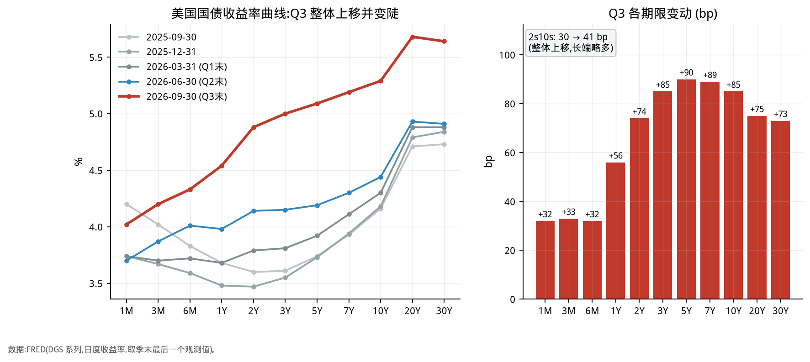

| 期限 | 2025-09-30 (%) | 2026-06-30 (%) | 2026-09-30 (%) | Q3 变动 (bp) | 同比变动 (bp) |
|---|---|---|---|---|---|
| 1M | 4.20 | 3.70 | 4.02 | +32 | -18 |
| 3M | 4.02 | 3.87 | 4.20 | +33 | +18 |
| 6M | 3.83 | 4.01 | 4.33 | +32 | +50 |
| 1Y | 3.68 | 3.98 | 4.54 | +56 | +86 |
| 2Y | 3.60 | 4.14 | 4.88 | +74 | +128 |
| 3Y | 3.61 | 4.15 | 5.00 | +85 | +139 |
| 5Y | 3.74 | 4.19 | 5.09 | +90 | +135 |
| 7Y | 3.93 | 4.30 | 5.19 | +89 | +126 |
| 10Y | 4.16 | 4.44 | 5.29 | +85 | +113 |
| 20Y | 4.71 | 4.93 | 5.68 | +75 | +97 |
| 30Y | 4.73 | 4.91 | 5.64 | +73 | +91 |
| 30Y 按揭利率 | 6.30 | 6.49 | 7.03 | +54 | +73 |
| 联邦基金有效利率 | 4.09 | 3.63 | 3.88 | +25 | -21 |
| 2s10s (bp) | 56 | 30 | 41 | +11 | -15 |

*数据:FRED。2s10s 与变动单位为 bp,其余为 %。*

### 读图要点

- **形状**:Q3 的上行不是平行移动。短端(1M-6M)只涨约 32-33bp,1Y 涨 56bp,2Y 涨 74bp,3Y-7Y 涨 85-90bp(5Y 最大),10Y 涨 85bp,20Y-30Y 涨约 73-75bp。涨幅最大的是中段(5Y 附近),所以 3M 到 5Y 之间的斜率明显变陡。

- **2s10s**:季末为 41bp,季初为 30bp,只多 11bp,但路径不平:9/22 一度收窄到约 22bp(图 3 右)。

- **同比对比(期间可比性)**:和一年前(2025-09-30)相比,2Y 高 128bp,10Y 高 113bp,而联邦基金有效利率反而低 21bp(4.09% 到 3.88%)。也就是说,中长端的上行主要不是政策利率推动的。2s10s 同比反而更窄(56bp 到 41bp)。

- **季均 vs 期末**:联邦基金有效利率 Q3 季均比 Q2 只高 4bp,因为 9/16 才加息;期末比 6/30 高 25bp。负债成本的上行主要在 Q4 兑现。

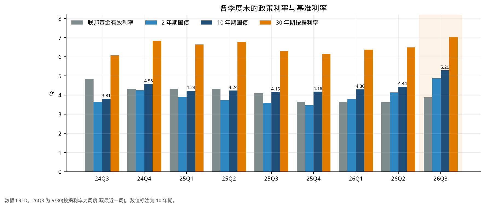

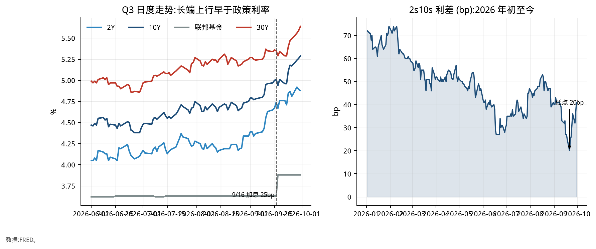

*图 2 的柱状图把 9 个季度并排放在一起:从 2025Q3 到 2026Q2 政策利率从 4.09% 降到 3.63%,而 10Y 从 4.16% 升到 4.44%,2026Q3 长端再大幅抬升;这就是 Q3 的「长端先动、政策利率后动」的背景。*

## 12. 期限结构变化如何传导到存款成本与贷款收入

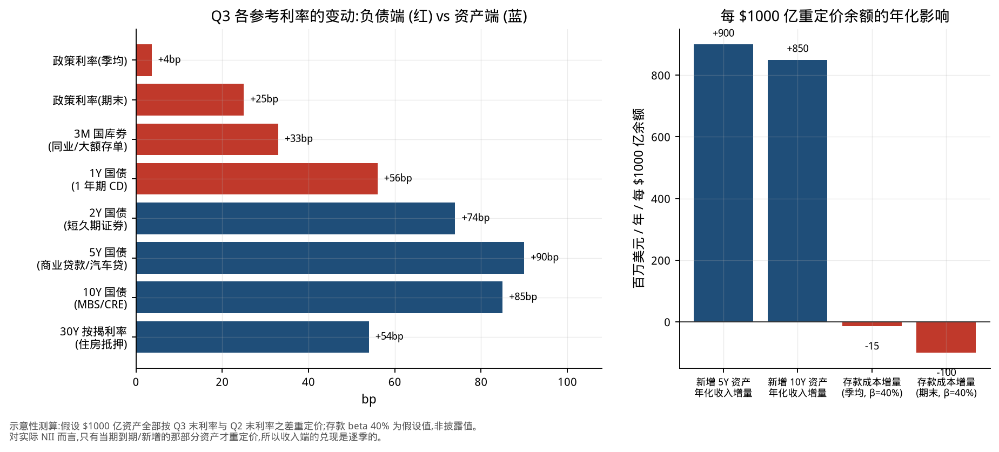

| 银行产品/资产 | 对应参考利率 | Q3 变动 (bp) | 方向 |
|---|---|---|---|
| 活期/储蓄存款(季均) | 联邦基金有效利率(季均) | +4 | 负债 |
| 活期/储蓄存款(期末) | 联邦基金有效利率(期末) | +25 | 负债 |
| 同业/大额存单 | 3M | +33 | 负债 |
| 1 年期定存 | 1Y | +56 | 负债 |
| 短久期证券 | 2Y | +74 | 资产 |
| 商业贷款/汽车贷 | 5Y | +90 | 资产 |
| MBS/商业地产 | 10Y | +85 | 资产 |
| 住房抵押贷款 | 30Y 按揭利率 | +54 | 资产 |

### 示意性测算(每 $1000 亿重定价余额)

| 项目 | 年化金额 ($M) |
|---|---|
| 新增或再投资 5Y 资产的收入增量 | +900 |
| 新增或再投资 10Y 资产的收入增量 | +850 |
| 存款成本增量(季均口径,β=40%) | -15 |
| 存款成本增量(期末口径,β=40%) | -100 |
| 存款成本增量(期末口径,β=60%) | -150 |

- **含义**:每 $1000 亿资产在新利率上重定价,年化多收约 $900M(5Y 口径),而 Q3 季均的存款成本只多付约 $15M。这就是第 0 节说的「资产重定价先于负债」的 NII 顺风。

- **但顺风会收窄**:按期末利率、β=40% 算,存款成本多付 $100M;β 升到 60% 则是 $150M。Q4 起存款成本才完整反映 9/16 的加息,所以顺风是逐季衰减的。

- **只有一部分资产会重定价**:实际 NII 只受当期到期和新增的那部分资产影响。因此图是上限的示意,不是 NII 预测。NII 的预测见第 3.1 节与第 4 节的 bridge。

- **假设**:100% 的 $1000 亿余额按「Q3 末利率 − Q2 末利率」重定价;存款 β=40% 是假设值,不是披露值。

## 13. 六大行分部门收入:近两年走势与 Q3 预测

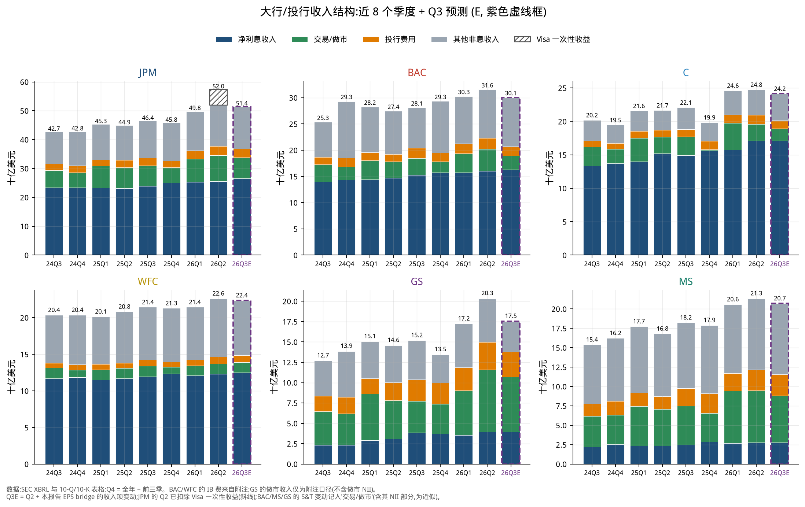

| 银行 | Q3'25 | Q2'26(JPM 已剔除 Visa) | Q3'26E | 环比 | 同比 |
|---|---|---|---|---|---|
| JPM | 46.4 | 52.0 | 51.4 | -1.1% | +10.8% |
| BAC | 28.1 | 31.6 | 30.1 | -4.8% | +7.0% |
| C | 22.1 | 24.8 | 24.2 | -2.4% | +9.4% |
| WFC | 21.4 | 22.6 | 22.4 | -1.1% | +4.4% |
| GS | 15.2 | 20.3 | 17.5 | -13.8% | +15.5% |
| MS | 18.2 | 21.3 | 20.7 | -3.0% | +13.6% |

*总收入,$bn,GAAP 口径(NII + 非息收入)。*

### Q3'26E 分部门收入 ($bn)

| 银行 | 净利息收入 | 投行费用 | 交易/做市 | 其他非息 | 合计 |
|---|---|---|---|---|---|
| JPM | 26.51 | 3.05 | 7.31 | 14.56 | 51.43 |
| BAC | 16.30 | 1.74 | 2.63 | 9.40 | 30.06 |
| C | 17.13 | 1.21 | 1.78 | 4.05 | 24.17 |
| WFC | 12.52 | 0.94 | 1.39 | 7.52 | 22.37 |
| GS | 3.95 | 3.10 | 6.74 | 3.75 | 17.54 |
| MS | 2.78 | 2.75 | 6.02 | 9.14 | 20.70 |

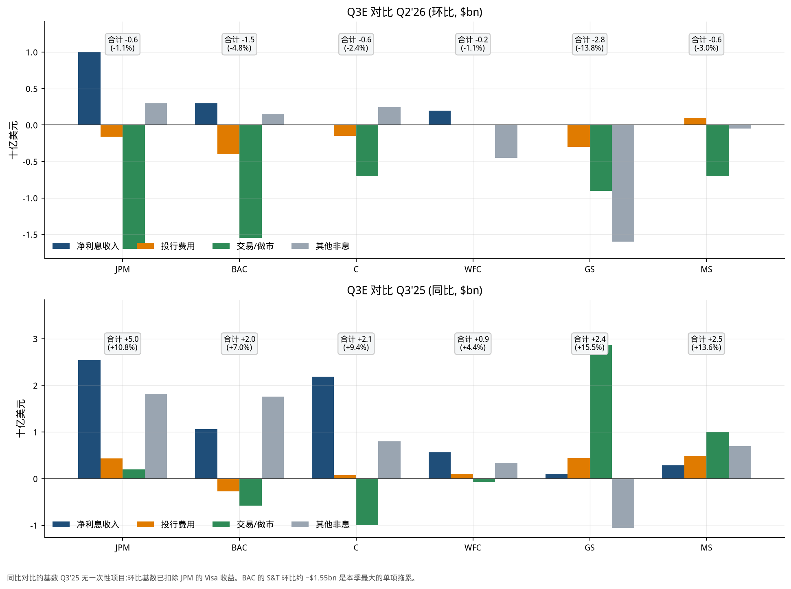

### Q3'26E 相对 Q2'26 的环比变化 ($bn)

| 银行 | 净利息收入 | 投行费用 | 交易/做市 | 其他非息 | 合计 |
|---|---|---|---|---|---|
| JPM | +1.00 | -0.16 | -1.70 | +0.30 | -0.56 |
| BAC | +0.30 | -0.40 | -1.55 | +0.15 | -1.50 |
| C | 0.00 | -0.15 | -0.70 | +0.25 | -0.60 |
| WFC | +0.20 | 0.00 | 0.00 | -0.45 | -0.25 |
| GS | 0.00 | -0.30 | -0.90 | -1.60 | -2.80 |
| MS | 0.00 | +0.10 | -0.70 | -0.05 | -0.65 |

### Q3'26E 相对 Q3'25 的同比变化 ($bn)

| 银行 | 净利息收入 | 投行费用 | 交易/做市 | 其他非息 | 合计 |
|---|---|---|---|---|---|
| JPM | +2.55 | +0.44 | +0.20 | +1.82 | +5.00 |
| BAC | +1.06 | -0.28 | -0.58 | +1.76 | +1.97 |
| C | +2.19 | +0.08 | -0.99 | +0.80 | +2.08 |
| WFC | +0.57 | +0.10 | -0.07 | +0.34 | +0.94 |
| GS | +0.10 | +0.44 | +2.87 | -1.06 | +2.35 |
| MS | +0.29 | +0.49 | +1.00 | +0.70 | +2.47 |

### 读图要点

- **环比:资本市场回落,NII 仍在涨。**六家的交易线都是下降或持平,投行线多数下降;NII 在 JPM、BAC、WFC 上升,C、GS、MS 的 NII 在我们的桥里没有新增项,按持平处理。

- **BAC 的交易线** 环比 -1.55B(Q2 4.18B 到 Q3E 2.63B),是六家里最大的单项收缩之一,这也是第 4.1 节里 BAC EPS 低于共识的核心原因。

- **GS 的降幅最大**(总收入环比 -13.8%),主要来自「其他非息」(投资线,-1.60B)和交易(-0.90B)。同比仍是 +15.5%,因为 Q3'25 基数较低。

- **期间可比性**:JPM 的 Q2'26 里 Visa 一次性收益约 $5.4B 在图 5 中用斜线标出,表格和图 6 的环比已剔除;否则 JPM 的环比会被夸大成约 −10%。

- **局限**:C 的 NII 和 IB、交易线的 Q4 来自 XBRL 回补而非 10-K 表格;Q3E 是我们的桥(第 4 节),WFC 的 IB 和交易线没有指引,按持平处理。

## 14. EPS、P/E 与市场指标

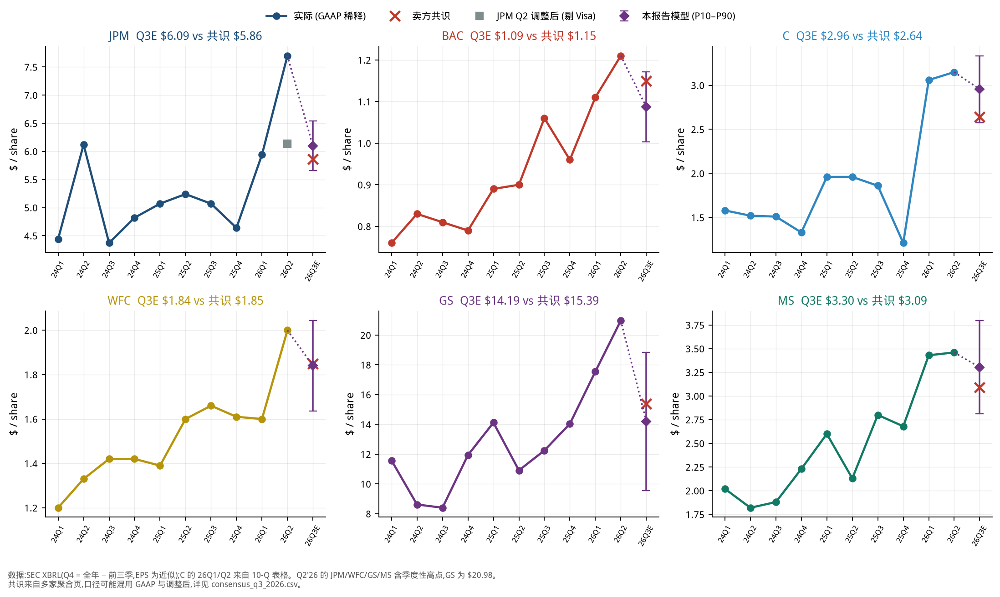

| 银行 | Q3'25 EPS | Q2'26 EPS(JPM 为剔除 Visa) | Q3E 共识 | Q3E 模型 | P10-P90 | 对共识 | 同比 |
|---|---|---|---|---|---|---|---|
| JPM | 5.07 | 6.14 | 5.86 | 6.10 | 5.66-6.54 | +4.0% | +20.2% |
| BAC | 1.06 | 1.21 | 1.15 | 1.09 | 1.00-1.17 | -5.5% | +2.5% |
| C | 1.86 | 3.15 | 2.64 | 2.96 | 2.58-3.33 | +11.9% | +58.9% |
| WFC | 1.66 | 2.00 | 1.85 | 1.84 | 1.64-2.04 | -0.5% | +10.8% |
| GS | 12.25 | 20.98 | 15.39 | 14.19 | 9.57-18.84 | -7.8% | +15.9% |
| MS | 2.80 | 3.46 | 3.09 | 3.30 | 2.81-3.80 | +6.9% | +18.0% |

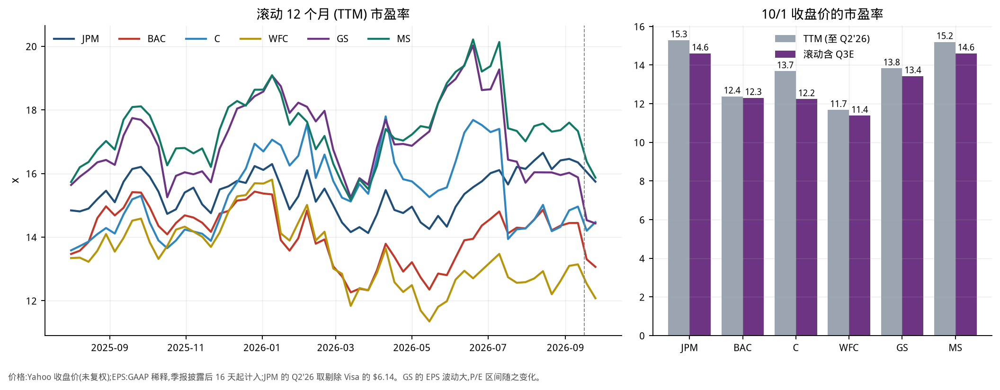

| 银行 | 10/1 收盘价 ($) | TTM EPS ($) | 一年前 P/E | 现在 P/E | 滚动含 Q3E 的 EPS ($) | P/E(含 Q3E) |
|---|---|---|---|---|---|---|
| JPM | 333.18 | 21.79 | 15.9x | 15.3x | 22.82 | 14.6x |
| BAC | 53.73 | 4.34 | 14.9x | 12.4x | 4.37 | 12.3x |
| C | 127.00 | 9.28 | 14.6x | 13.7x | 10.38 | 12.2x |
| WFC | 80.25 | 6.87 | 13.9x | 11.7x | 7.05 | 11.4x |
| GS | 896.67 | 64.82 | 17.3x | 13.8x | 66.76 | 13.4x |
| MS | 188.01 | 12.37 | 17.7x | 15.2x | 12.87 | 14.6x |

*P/E = 未复权收盘价 ÷ TTM EPS(GAAP 稀释;JPM Q2'26 用剔除 Visa 的 $6.14;季报披露后 16 天起计入)。GS 的单季 EPS 波动大,P/E 随之大幅变化。*

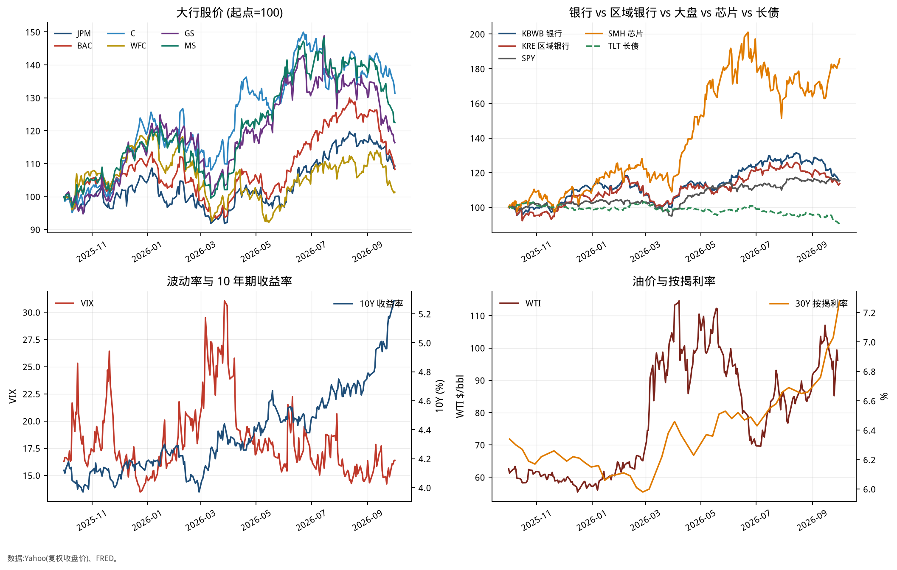

### 读图要点

- **估值**:按 TTM,JPM 的 P/E 最高(15.3x),WFC 最低(11.7x);滚动纳入 Q3E 后,所有银行的 P/E 都会变化,幅度取决于 Q3E 相对 Q3'25 的 EPS 变化。

- **EPS 与共识**:C、MS、JPM 的模型值高于共识,BAC、GS 低于共识,WFC 基本一致(见表与图 7 的标题)。Q2'26 是创纪录季度,所以 Q3E 对 Q2 环比普遍下降;同比大多仍是上升。

- **市场**:图 9 显示 3 月的 VIX 冲高和股价回撤,之后大行修复;9 月起 10Y 与按揭利率同步上行,TLT 下跌,银行与区域银行 ETF 也在 9 月回撤(第 6.1 节)。SMH 的涨幅远高于银行,与第 8 节「最像 1999 年」的类比一致。

## 15. AFS / HTM 账面价值的变化,以及对大行的影响

本节只分析六大行(JPM、BAC、C、WFC、GS、MS),区域银行见第 7 节的评分表。

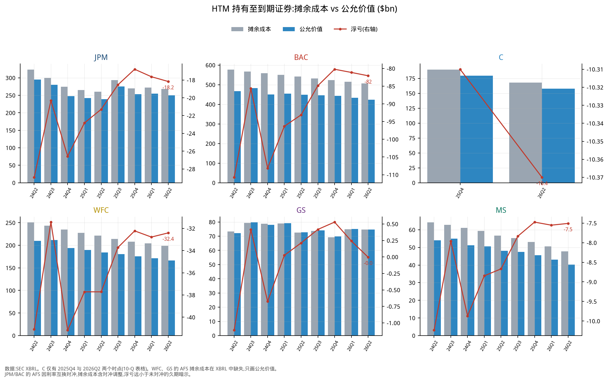

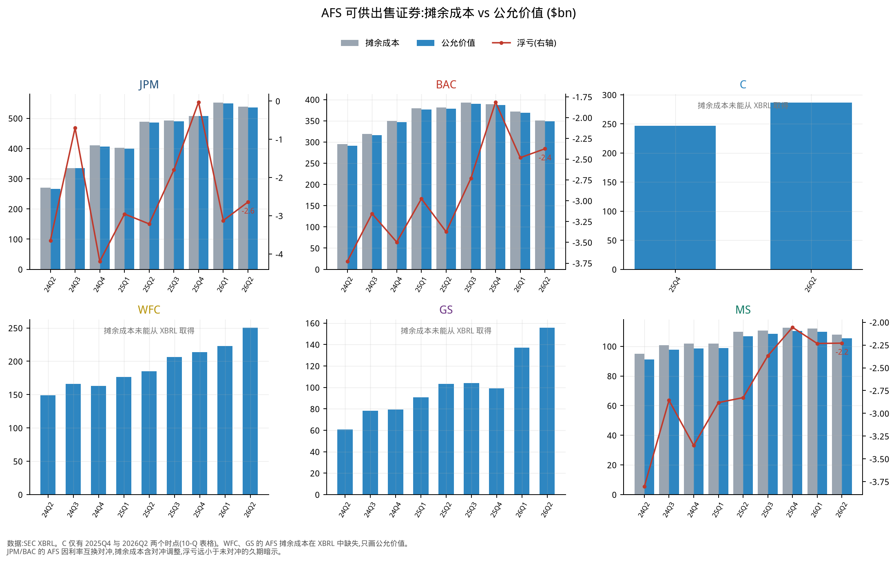

| 银行 | AFS 公允价值 6/30/26 | HTM 摊余成本 6/30/26 | HTM 公允价值 6/30/26 | HTM 未实现损益 6/30/25 | HTM 未实现损益 12/31/25 | HTM 未实现损益 6/30/26 |
|---|---|---|---|---|---|---|
| JPM | 536.0 | 268.5 | 250.3 | -21.3 | -16.8 | -18.2 |
| BAC | 348.5 | 505.8 | 423.7 | -93.1 | -80.2 | -82.1 |
| C | 286.8 | 167.9 | 157.5 | n/a | -10.3 | -10.4 |
| WFC | 250.3 | 198.6 | 166.2 | -37.7 | -32.2 | -32.4 |
| GS | 155.6 | 74.7 | 74.7 | 0.2 | 0.5 | -0.0 |
| MS | 105.5 | 47.7 | 40.2 | -8.7 | -7.5 | -7.5 |

*$bn,SEC XBRL;C 的 12/31/25 与 6/30/26 来自 10-Q 表格,6/30/25 缺失。GS 与 MS 的 HTM 规模小。*

### Q3 的利率上行把账面价值推低了多少(pro forma)

| 银行 | TCE ($bn) | AFS→AOCI ($bn) | 占 TCE | HTM 减值,税后 ($bn) | 占 TCE | Q3E 季度盈利 ($bn) | 合计 ÷ Q3E 盈利 |
|---|---|---|---|---|---|---|---|
| JPM | 300.9 | -8.20 | -2.7% | -3.27 | -1.1% | 16.3 | 0.70x |
| BAC | 206.0 | -2.42 | -1.2% | -10.43 | -5.1% | 7.8 | 1.64x |
| C | 168.4 | -2.67 | -1.6% | -3.10 | -1.8% | 5.1 | 1.14x |
| WFC | 139.9 | -4.99 | -3.6% | -3.59 | -2.6% | 5.6 | 1.54x |
| GS | 100.4 | -1.86 | -1.9% | -1.38 | -1.4% | 4.3 | 0.75x |
| MS | 84.1 | -1.74 | -2.1% | -0.88 | -1.0% | 5.2 | 0.51x |

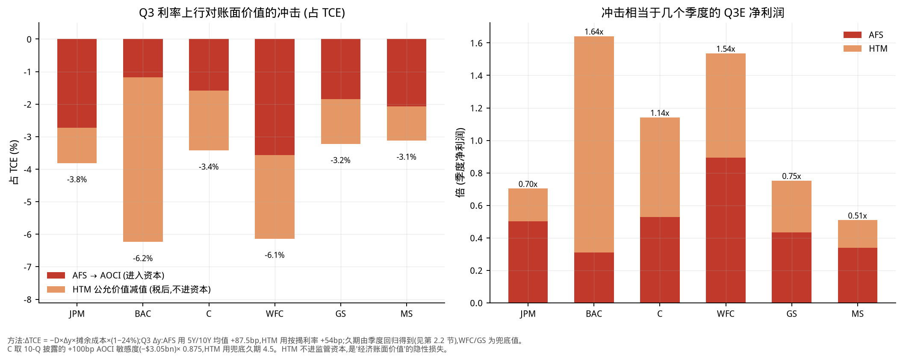

### 读图要点

- **BAC 最特别**:AFS 只有约 1 年久期、且有利率互换对冲,所以 AOCI 冲击很小(-1.2% TCE);但 HTM 有 $506B,未实现损失 $82.1B(约占 TCE 的 40%),Q3 再增约 $13.7B(税前)。它不进监管资本,但是「经济 TBV」的隐性损失。

- **WFC**:AFS 加 HTM 两边都有风险,Q3 的合计冲击占 TCE 最高之一;它的 AFS 摊余成本在 XBRL 缺失,AFS 久期用兜底值,精度较低。

- **JPM**:HTM 浮亏 $18B 左右,AFS 浮亏仅 $2.6B(因为对冲);相对 TCE 和盈利规模,影响居中。

- **GS 与 MS**:GS 的 HTM 摊余成本约等于公允价值(未实现损益接近 0),MS 浮亏 $7.5B;两者受 AOCI 冲击都小。GS 的 AFS 以短久期国库券为主。

- **C**:AOCI 的口径用 10-Q 披露的 +100bp 敏感度(税后 −$3.0B)乘以 0.875 近似 Q3 的 87.5bp;HTM 的久期 4.5 年是假设值。

- **方法**:AFS 冲击 = −D × Δy × 摊余成本 ×(1 − 24%),Δy = +87.5bp;HTM 减值 = −D × Δy × 摊余成本(Δy = 按揭利率 +54bp),表中按 24% 税率折算为税后。公式见第 2.2 节。

## 16. 利率压力测试:如果继续加息

**设问**:在已经发生的 Q3 上行之外,如果收益率曲线再上移,六大行的一年内经济影响有多大?

| 情景 | 短端冲击 | 长端冲击 | 含义 |
|---|---|---|---|
| +50bp 平行 | +50bp | +50bp | 再加息两次 25bp 且长端同步 |
| +100bp 平行 | +100bp | +100bp | 基准压力情景 |
| +200bp 平行 | +200bp | +200bp | 极端情景 |
| 熊陡:长端 +100bp | 0 | +100bp | 期限溢价上行,政策利率不动 |
| 熊平:短端 +100bp | +100bp | 0 | 纯政策利率冲击,AFS/HTM 估值不变 |

### 方法

- **NII**:取各行 10-Q 披露的 12 个月 NII 敏感度(+100bp、+200bp、长端 +100bp、短端 +100bp),税率 24%;+50bp = 0.5 × (+100bp)。

- **AFS→AOCI**:久期模型 × 长端冲击(C 为 10-Q 披露的 AOCI 初始冲击),税后;立即发生。

- **HTM 减值**:久期 × 长端冲击 × 摊余成本,按 24% 折算为税后;不进监管资本,也不进利润表,只是经济价值的损失。

- **净经济影响** = 12 个月 NII(税后)+ AOCI + HTM 减值(税后)。**净资本影响** = NII + AOCI(不含 HTM)。两者的占比分母是 6/30 的 TCE 与「4 × Q3E EPS × 股数」的年化盈利。

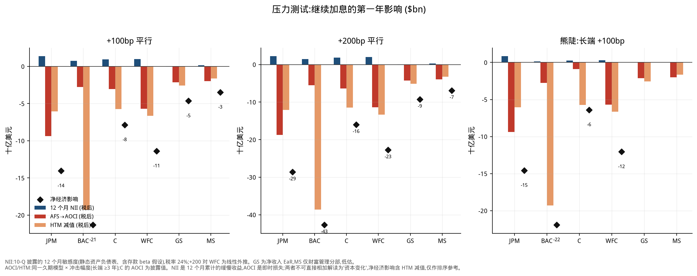

### 净经济影响 ($bn)

| 银行 | +50bp 平行 | +100bp 平行 | +200bp 平行 | 熊陡 长端+100 | 熊平 短端+100 |
|---|---|---|---|---|---|
| JPM | -7.0 | -14.0 | -28.6 | -14.6 | +0.5 |
| BAC | -10.7 | -21.3 | -42.7 | -21.9 | +0.6 |
| C | -3.9 | -7.9 | -16.0 | -6.4 | -1.5 |
| WFC | -5.7 | -11.4 | -22.7 | -12.1 | +0.7 |
| GS | -2.3 | -4.6 | -9.3 | n/a | n/a |
| MS | -1.7 | -3.5 | -6.9 | n/a | n/a |

### 净经济影响占 TCE (%)

| 银行 | +50bp 平行 | +100bp 平行 | +200bp 平行 | 熊陡 长端+100 | 熊平 短端+100 |
|---|---|---|---|---|---|
| JPM | -2.3 | -4.7 | -9.5 | -4.8 | +0.2 |
| BAC | -5.2 | -10.3 | -20.7 | -10.6 | +0.3 |
| C | -2.3 | -4.7 | -9.5 | -3.8 | -0.9 |
| WFC | -4.1 | -8.1 | -16.3 | -8.6 | +0.5 |
| GS | -2.3 | -4.6 | -9.2 | n/a | n/a |
| MS | -2.1 | -4.1 | -8.2 | n/a | n/a |

### 净经济影响占年化 Q3E 盈利 (%)

| 银行 | +50bp 平行 | +100bp 平行 | +200bp 平行 | 熊陡 长端+100 | 熊平 短端+100 |
|---|---|---|---|---|---|
| JPM | -11 | -22 | -44 | -22 | +1 |
| BAC | -34 | -68 | -136 | -70 | +2 |
| C | -19 | -39 | -79 | -32 | -8 |
| WFC | -25 | -51 | -102 | -54 | +3 |
| GS | -13 | -27 | -54 | n/a | n/a |
| MS | -8 | -17 | -34 | n/a | n/a |

### +100bp 平行情景的构成 ($bn)

| 银行 | 12M NII(税后) | AFS→AOCI | HTM 减值(税后) | 净资本影响 | 净经济影响 |
|---|---|---|---|---|---|
| JPM | +1.37 | -9.38 | -6.04 | -8.01 | -14.05 |
| BAC | +0.76 | -2.77 | -19.30 | -2.01 | -21.31 |
| C | +0.94 | -3.05 | -5.74 | -2.11 | -7.85 |
| WFC | +0.99 | -5.71 | -6.66 | -4.72 | -11.37 |
| GS | +0.04 | -2.13 | -2.55 | -2.09 | -4.64 |
| MS | +0.15 | -1.99 | -1.63 | -1.84 | -3.47 |

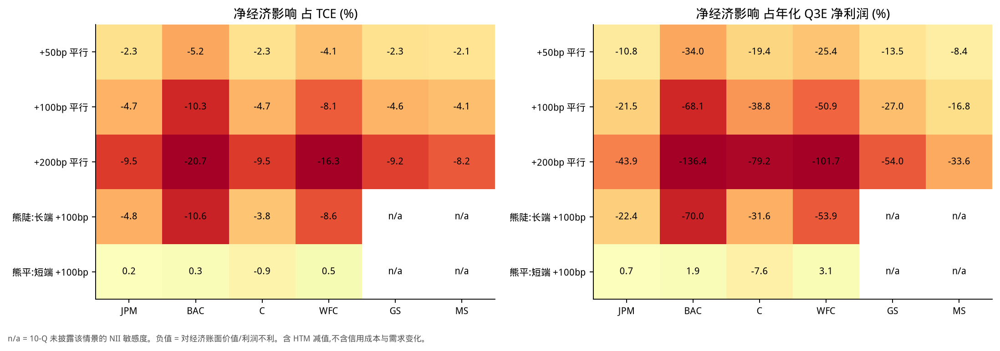

### 读图要点

- **BAC 最脆弱,而且几乎全是 HTM**:+100bp 的净经济影响 -$21.3B(占 TCE -10.3%,占年化盈利 -68%),其中 HTM -$19.3B;只看进入资本的部分(NII+AOCI)只有 -$2.0B。+200bp 时净经济影响超过一整年的盈利。

- **WFC 次之**:-$11.4B(占 TCE -8.1%);与 BAC 不同,WFC 的 AFS 同样敏感(AOCI -$5.7B),所以进入资本的部分也不小(-$4.7B)。

- **JPM 的 NII 顺风最大**(+100bp 税后 +$1.4B,为六家最高),抵消了一部分估值损失,净经济影响 -$14.0B,占年化盈利 22%。

- **熊陡 vs 熊平**:长端冲击(熊陡)对四家商业大行都是净负,因为 AOCI 和 HTM 估值损失超过了新增 NII;短端冲击(熊平)对 JPM、BAC、WFC 是小幅净正(NII 增加、估值不变),对 C 是小幅净负(其披露的短端 AOCI 冲击较大)。这说明 **风险在长端,不在政策利率**。

- **GS 与 MS** 的 NII 敏感度口径不可比(GS 为对净收入的 EaR,MS 仅财富管理分部),所以它们的 NII 偏小、净影响被高估;熊陡/熊平没有披露(n/a)。

### 局限

- 线性久期,没有凸性;AFS/HTM 的久期是回归值或兜底值(AFS 3.0 年、HTM 4.5 年),不是披露值。

- 基于 6/30 的资产负债表和 6/30 的 10-Q 敏感度,没有更新到 Q3 末;Q3 已发生的上行见第 15 节,与压力测试是叠加关系而不是包含关系。

- 不含信贷成本、贷款需求变化、存款流失与再投资策略的变化;这些在加息中通常是更大的不确定性。

- 净经济影响把一年内逐步实现的 NII 与即时的估值损失相加,只作排序参考,不是资本比率预测。HTM 损失只有在出售或重分类时才会实现。

- WFC 的 +200bp NII 未披露,用线性外推。

## 17. IPO:Q3 做了哪些项目,Q4 还会做哪些,每一单收入如何

**先看大局**:Q3 美国 IPO 约 31 单、募资约 $34.9B,其中 SK hynix 一单约 $26.5B,去掉它只有约 $8.4B。我们逐单梳理了 18 单(合计约 $32.6B,去掉 SK hynix 约 $6.1B,约占去掉巨型交易后总募资的 73%)。费用是 **披露值** 或 **费率 × 规模的估算**,各行的分成按角色加权,是估算。

### 17.1 Q3 已定价的项目与承销费

| 项目 | 日期 | 行业 | 募资 ($M) | 承销费 ($M) | 费率 | 依据 | 牵头/联席行(节选) |
|---|---|---|---|---|---|---|---|
| SK hynix | 2026-07-09 | Semis / ADR | 26,507 | 257.5 | 0.97% | 披露 | BofA / Citi / GS / JPM (global coordinators) |
| Jersey Mike's | 2026-07-29 | Consumer | 1,000 | 50.0 | 5.00% | 披露 | MS / Jefferies / JPM (global coordinators); Barclays, Guggenheim |
| Csquare | 2026-07-16 | Telecom svcs | 1,050 | 40.0 | 3.81% | 披露 | MS, TD (reps); Wells, BofA, BMO, Scotia, JPM |
| Accelevation | 2026-09-30 | Industrial | 540 | 27.0 | 5.00% | 估算 | MS, JPM, GS, Barclays, BofA |
| ADARx | 2026-09-24 | Biotech | 446 | 31.2 | 7.00% | 估算 | JPM, MS, TD Cowen, UBS |
| Braveheart Bio | 2026-08-05 | Biotech | 383 | 26.8 | 7.00% | 估算 | GS, Jefferies, TD Cowen, Stifel, Cantor |
| Electra | 2026-09-17 | Biotech | 350 | 24.5 | 7.00% | 估算 | Jefferies, TD Cowen, Evercore, Cantor |
| Latigo | 2026-08-06 | Biotech | 346 | 24.2 | 7.00% | 估算 | GS, Jefferies, Leerink, Guggenheim |
| Lyntris | 2026-08-18 | Tech | 298 | 20.9 | 7.00% | 估算 | Evercore, Citi, Guggenheim; BofA |
| Attovia | 2026-08-04 | Biotech | 289 | 20.2 | 7.00% | 披露 | MS, Leerink, Citi, RBC |
| Orion180 | 2026-09-17 | Biotech | 240 | 16.8 | 7.00% | 估算 | RBC, UBS, Raymond James; GS |
| Reformation | 2026-07-29 | Consumer | 211 | 14.8 | 7.00% | 估算 | JPM, MS; Citi, RBC |
| Apnimed | 2026-07-30 | Biotech | 192 | 13.4 | 7.00% | 估算 | BofA, Evercore, Cantor, LifeSci |
| Robinhood Ventures Fund II | 2026-09 | Closed-end fund | 200 | 9.0 | 4.50% | 估算 | GS, Citi, JPM, UBS, Wells |
| Standard Nuclear | 2026-07-15 | Energy | 150 | 10.5 | 7.00% | 估算 | BofA, GS |
| BlossomHill | 2026-08-06 | Biotech | 150 | 10.5 | 7.00% | 估算 | JPM, Leerink, Guggenheim |
| American Savings Bank | 2026-09-15 | Bank (secondary) | 129 | 7.7 | 6.00% | 估算 | Piper Sandler |
| River City Bank | 2026-08-05 | Bank (secondary) | 122 | 5.9 | 4.87% | 披露 | KBW |
| **合计** |  |  | 32,602 | 611.0 | 1.87% |  |  |

*日期为定价日。Accelevation 于 9/30 定价,交割在季末前后,费用确认季度取决于各行会计政策。SK hynix 为美国上市,承销费 $257.5M 来自披露(约 0.97%);Jersey Mike's $50.0M、Csquare $40.0M(Brookfield 引入的股份不收费)、Attovia $20.23M、River City Bank $5.913M 也为披露值。其余按美国惯例:募资不足 $5 亿约 7%,$5-10 亿约 5%,封闭式基金 4.5% 销售费用。*

### 17.2 六大行的 Q3 IPO 承销费(估算)

| 项目 ($M) | JPM | BAC | C | WFC | GS | MS | 其他承销商 |
|---|---|---|---|---|---|---|---|
| SK hynix | 55.0 | 55.0 | 70.0 | - | 55.0 | - | 22.5 |
| Jersey Mike's | 6.7 | 3.3 | - | - | 3.3 | 6.7 | 30.0 |
| Csquare | 3.3 | 3.3 | - | 3.3 | - | 6.7 | 23.3 |
| Accelevation | 4.9 | 2.5 | - | - | 4.9 | 4.9 | 9.8 |
| ADARx | 7.8 | - | - | - | - | 7.8 | 15.6 |
| Braveheart Bio | - | - | - | - | 7.7 | - | 19.1 |
| Electra | - | - | - | - | - | - | 24.5 |
| Latigo | - | - | - | - | 8.1 | - | 16.1 |
| Lyntris | - | 3.0 | 6.0 | - | - | - | 11.9 |
| Attovia | - | - | 3.4 | - | - | 6.7 | 10.1 |
| Orion180 | - | - | - | - | 2.4 | - | 14.4 |
| Reformation | 4.9 | - | 2.5 | - | - | 4.9 | 2.5 |
| Apnimed | - | 4.5 | - | - | - | - | 9.0 |
| Robinhood Ventures Fund II | 1.5 | - | 1.5 | 1.5 | 1.5 | - | 3.0 |
| Standard Nuclear | - | 4.2 | - | - | 4.2 | - | 2.1 |
| BlossomHill | 3.5 | - | - | - | - | - | 7.0 |
| American Savings Bank | - | - | - | - | - | - | 7.7 |
| River City Bank | - | - | - | - | - | - | 5.9 |
| **合计** | 87.6 | 75.8 | 83.3 | 4.8 | 87.1 | 37.7 | 234.6 |

| 银行 | 参与项目数 | 估算 IPO 费用 ($M) | Q3E 投行费用 ($M) | 占比 |
|---|---|---|---|---|
| JPM | 8 | 87.6 | 3,048 | 2.9% |
| BAC | 7 | 75.8 | 1,738 | 4.4% |
| C | 5 | 83.3 | 1,208 | 6.9% |
| WFC | 2 | 4.8 | 939 | 0.5% |
| GS | 8 | 87.1 | 3,100 | 2.8% |
| MS | 6 | 37.7 | 2,751 | 1.4% |

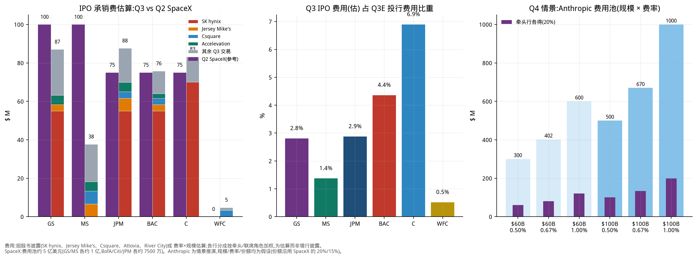

### 读图要点

- **IPO 费用只是投行费用的一小块**:六大行里最高的是 C,也只有约 6.9%;其余多为 1%-5%。投行费用更大的部分是并购顾问、债券和杠杆融资承销。这支持第 0 节「IPO 火热对 Q3 费用不成立」。

- **一单就决定排名**:SK hynix 费用 $257.5M 占所有梳理项目费用的 42%,Citi 估算约 $70M(报道称超过 $70M),BofA、GS、JPM 各约 $55M(估算);去掉它,各行的 IPO 费用都只有十几到几十百万美元。

- **费率与规模成反比**:SK hynix 约 0.97%,SpaceX 约 0.67%(基础发行 $750 亿对应约 $5 亿),$10 亿级约 4%-5%,$3 亿以下生物科技约 7%。所以募资额大不等于费用大。

- **Q2 对照**:SpaceX 一单的费用池约 $500M(GS、MS 各约 $100M,BofA、Citi、JPM 各约 $75M),与我们梳理的 Q3 全部 18 单合计(约 $611M)相当。这是 Q2 投行费用创纪录的关键。

### 17.3 Q4 已知的 IPO 管线

| 项目 | 时间 | 规模 ($M) | 费率假设 | 费用估算 ($M) | 牵头行 | 状态 |
|---|---|---|---|---|---|---|
| Anthropic | Nov 2026 (after midterms) | 100,000 | 0.67% | 670 | MS, GS (leads); JPM, Citi | roadshow mid-Oct; no public S-1 yet |
| Oura | Postponed on 9/29 | 2,150 | 5.00% | 108 | n/d | planned 50M sh at $40-44; postponed |
| Entrata | Q4 | 500 | 6.00% | 30 | GS, JPM, Barclays | NYSE: ENT; ~$500M target |
| SB Energy | Q4 (reportedly delayed) | n/d | - | n/d | JPM, GS, MS, Citi + others | S-1/A #2 on 9/21; NVIDIA $3B private placement |
| Encore | Q4 | n/d | - | n/d | BofA, GS, MS | size n/d |
| Aggreko | Q4 | n/d | - | n/d | n/d | F-1 filed, NYSE: AGKO |
| Nscale | Q4 | n/d | - | n/d | n/d | NYSE filing |
| Inspire Brands | year-end / early 2027 | n/d | - | n/d | n/d | timing may slip |
| City Therapeutics | Q4 | n/d | - | n/d | GS, Jefferies | biotech; size n/d |
| OpenAI | 2027 | n/d | - | n/d | n/d | pushed to 2027 |

*n/d = 未披露。除 Anthropic 外,规模来自媒体或备案文件,可能变化;费率为假设。Oura 已于 9/29 推迟。管线中的其他项目(Switch、Holtec Nuclear、Tailored Brands、CoVolt Power、Wella、Iambic、Retension、TRex Bio 等)规模多未披露,未估算。Renaissance 估计年底前 40-70 单较大的美国 IPO 可能募资超过 $1250 亿,取决于巨型交易是否成行。*

### 17.4 Anthropic 情景:Q4 最大的费用变量

据媒体报道,Anthropic 目标 11 月、中期选举之后上市,募资规模最高约 $1000 亿、估值约 2 万亿美元,路演预计 10 月中旬,牵头行为 MS 和 GS,JPM 和 Citi 参与;截至本文日期尚无公开 S-1,所有信息未经证实。OpenAI 已推迟到 2027 年。下面的表是假设推演,不是预测。

| 募资规模 | 费率 | 费用池 ($M) | 牵头行各得 20% ($M) | 其他主承销商各得 15% ($M) |
|---|---|---|---|---|
| $60B | 0.50% | 300 | 60 | 45 |
| $60B | 0.67% | 402 | 80 | 60 |
| $60B | 1.00% | 600 | 120 | 90 |
| $100B | 0.50% | 500 | 100 | 75 |
| $100B | 0.67% | 670 | 134 | 101 |
| $100B | 1.00% | 1,000 | 200 | 150 |

| 银行(基准:$1000 亿、0.67%) | 份额假设 | 估算费用 ($M) | Q3E 投行费用 ($M) | 相当于一个季度投行费用的 |
|---|---|---|---|---|
| MS | 20% | 134 | 2,751 | 4.9% |
| GS | 20% | 134 | 3,100 | 4.3% |
| JPM | 15% | 101 | 3,048 | 3.3% |
| C | 15% | 101 | 1,208 | 8.3% |

- **假设来源**:费率 0.5%/0.67%/1.0% 涵盖了巨型交易的区间(SpaceX 约 0.67%,SK hynix 约 0.97%);份额沿用 SpaceX 的 20%(牵头)和 15%(其他主承销商)。

- **含义**:即使是史上最大的 IPO,在基准情景下对牵头行也只是约一个季度投行费用的 4%-5%,对 C 约 8%;关键是 **时点**:它若落在 11 月,就是 Q4 的增量,而不是 Q3 的。如果 AI 大额 IPO 推迟到 2027,Q4 的 IB 费用就更依赖并购与债券。

### 17.5 IPO 部分的局限

- 覆盖:18 单,约占去掉 SK hynix 后 Q3 募资的七成;其余约 12 单规模较小。

- 各行分成:除 SK hynix 与 SpaceX 有报道外,均按「牵头/全球协调人 = 2,联席账簿管理人 = 1,其他 = 0.5-1」加权;「其他承销商」包括未单列的中小券商。

- 费用确认:IPO 费用通常在定价/交割时确认,跨季项目可能进入下一季度;各行披露的投行费用还包含并购、债券、杠杆融资,这里只拆 IPO。

- 中国与香港的巨型 IPO(CXMT 约 $86 亿、中际旭创 $68-78 亿)由中资或国际银行承销,美国大行只在中际旭创里有 GS、MS 参与,未纳入上表。
